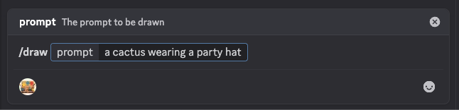
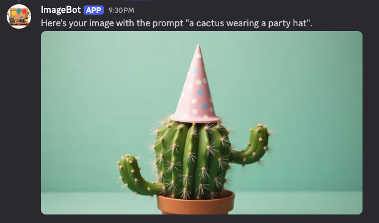

# Discord Image Bot

## Overview
This project is a Kotlin + SpringBoot discord bot. It generates images from a prompt using `FLUX.1 [dev] FP8`. It uses
Discord4J to interact with the Discord API.

## Why?

A personal learning project. Makes funny images. Discord SDK is cool.

## Usage

Prompt the bot using `/draw <prompt>`

Enjoy the image (or maybe not).

## Running the Bot

Ensure the environment variables `DISCORD_TOKEN` and `FIREWORKS_TOKEN` are supplied to the application runtime.

#### Developing Locally

1. Copy `application.properties` to `application-local.properties`
2. Replace Discord and Fireworks token with your own values
3. Optionally, add a property `dev.tomjack.bots.imagebot.discord.guildId` to `application-local.properties` with the 
guild ID of the server you use to develop with. This is to allow changes to the bot commands without waiting for the 1 
hour TTL on global commands.

## Acknowledgements & Thanks

This project is pretty much just a copy of [this repository](https://github.com/patw/discord_artist), but in Kotlin. 
Thanks for the idea!
